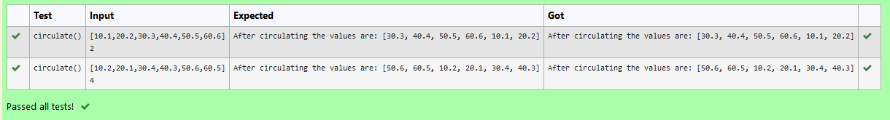

# Circulate-the-values-of-N-variables

## Aim:
To write a python program to circulate the n variables using function concept

## Equipment’s required:
PC
Anaconda - Python 3.7

## Algorithm: 

### Step 1:
 Git the list of values from thr user.

### Step 2: 
Get the values from the user for thr number of rotation

### Step 3:
 Declare a function starting with a keyword"def"

### Step 4:
 within the function print the output statement.

### Step 5: 
Using the slicing concept rotate the list.

### Step 6: 
Display the output.

## Program:
```
#Program to circulate N values.
#Developed by:nithyaa sri s s 
#RegisterNumber:22008434
a=eval(input())
b=int(input())
def circulate(): 
    for n in range (b+1):
        c=a[n:]+a[:n]
    return c
print("After circulating the values are:",circulate())
```

## Output:


## Result:
Thus the circulate the values of N variables are created 
